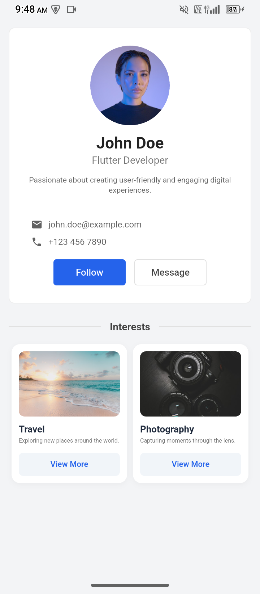

# Profile UI App - Flutter Assignment

A clean, modular, and responsive Profile UI built with Flutter for the **Module 8 Assignment**. The application strictly adheres to the reference design with high fidelity, pixel-perfect alignment, and clean architecture principles.

---

## 📸 Preview

<p align="center">
  
</p>

---

## ✨ Features

* **Profile Header:** Clean display of profile picture, name, profession, and bio.
* **Aligned Contact Information:** Left-aligned email and phone details with clear Material icons.
* **Interactive Action Buttons:** Distinct "Follow" and "Message" CTA buttons.
* **Section Divider:** Custom visual divider with an integrated section title ("Interests").
* **Interest Cards:** Responsive card layout featuring dynamic image loading, single-line truncated descriptions, and custom styled buttons.

---

## 🛠️ Tech Stack & Architecture

* **Framework:** [Flutter](https://flutter.dev/) (Dart)
* **UI Pattern:** Clean Component-Based Architecture (Modular Widgets)
* **Design Guidelines:** Material Design

---

## 📁 Project Structure

```text
lib/
├── data/
│   └── profile_dummy_data.dart    # Mock data for profile and interests
├── models/
│   └── interest_model.dart        # Data model for interest cards
├── screens/
│   └── profile_screen.dart        # Main layout screen
└── widgets/
    ├── action_buttons.dart        # Follow and Message buttons
    ├── contact_info_row.dart      # Reusable contact row (email/phone)
    ├── interest_card.dart         # Card widget for user interests
    └── profile_header.dart        # Top profile section (avatar, name, bio)